# Azure Monitor Add-on for Splunk

## NOTE

Please log your feature requests as issues.

This add-on is built using Node.js and Python 2.7 and has been tested on Ubuntu 14.04, Windows 10 and RHEL 7.

It consumes Metrics, Diagnostic Logs and the Activity Log according to the techniques defined by Azure Monitor, which provides highly granular and real-time monitoring data for Azure resources, and passes those selected by the user's configuration along to Splunk. 

Here are a few resources if you want to learn more about Azure Monitor:<br/>
* [Overview of Azure Monitor](https://docs.microsoft.com/en-us/azure/monitoring-and-diagnostics/monitoring-overview)
* [Overview of Azure Diagnostic Logs](https://docs.microsoft.com/en-us/azure/monitoring-and-diagnostics/monitoring-overview-of-diagnostic-logs)
* [Overview of the Azure Activity Log](https://docs.microsoft.com/en-us/azure/monitoring-and-diagnostics/monitoring-overview-activity-logs)
* [Overview of Metrics in Microsoft Azure](https://docs.microsoft.com/en-us/azure/monitoring-and-diagnostics/monitoring-overview-metrics)
* [Stream Azure monitoring data to an event hub for consumption by an external tool](https://docs.microsoft.com/en-us/azure/monitoring-and-diagnostics/monitor-stream-monitoring-data-event-hubs)

## Installation and Configuration (manual)

See the [Wiki](https://github.com/Microsoft/AzureMonitorAddonForSplunk/wiki/Azure-Monitor-Addon-For-Splunk) for detailed installation and configuration instructions. Release Notes (aka changelog) is also available in the wiki.

### What's an Azure AD Service Principal and where can I get one?
See here: [Use portal to create Active Directory application and service principal that can access resources](https://docs.microsoft.com/en-us/azure/azure-resource-manager/resource-group-create-service-principal-portal)<br/>

## Installation and Configuration ("mostly" automated)

1. Open `.\scripts\azure-setup.ps1`.  Replace the variables at the top of the script with values from your environment.
   * `$subscriptionId` : Your Azure subscription Id.
   * `$tenantId` : The tenant / directory Id for your Azure subscription.
   * `$splunkResourceGroupName` : The name of the resource group to deploy the cluster into.  This can be a new or existing resource group.
   * `$splunkResourceGroupLocation` : The location you want to deploy the cluster in.  For example, _eastus_, _westus_, etc.

   An example showing the variables populated is shown here:
   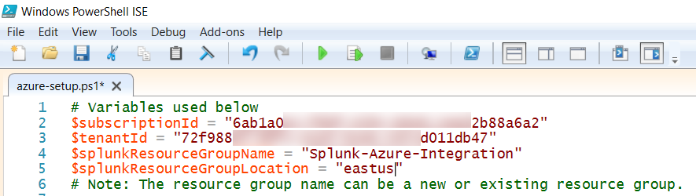
2. Run the script.
   * Note: The script will prompt you to authenticate to your Azure subscription.

   The output for the script will look similar to the output shown here:
   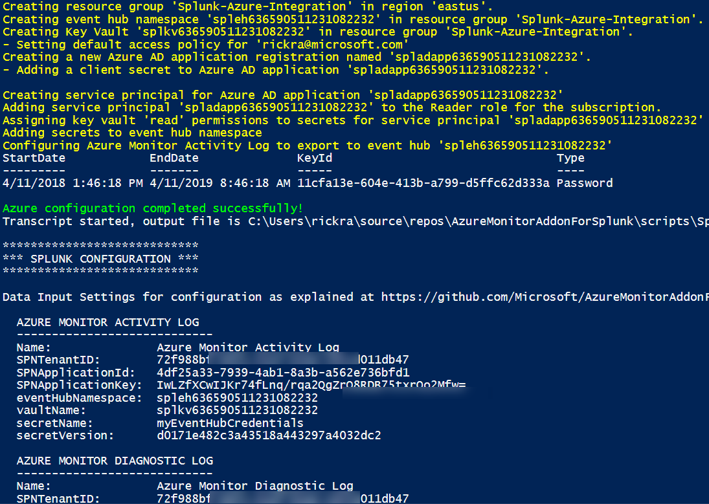
3. Install the add-on in Splunk Enterprise using the latest package file in `.\packages\*.spl`.
   * In Splunk, open the apps manager page by clicking on the gear icon.

      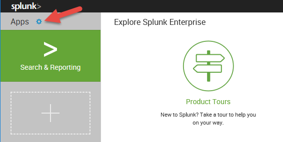

   * Click on the button labeled **Install app from file**.

   * In the dialog window, click the **Browse...** button and select the latest `*.spl` file in the `.\packages` folder.  Next, click the **Upload** button.

      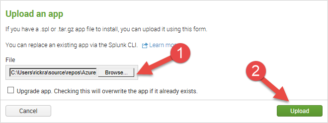

   * After uploading the add-on app, the apps manager page should show the application installed in Splunk.  An error message may also appear if the indicating the add-on could not initialize.  This is typically because dependencies for Python and/or Node.js are not present.

      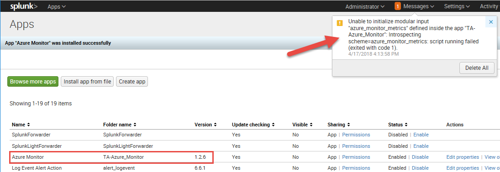

   * To resolve the error message stating Splunk is "Unable to initialize modular input", install Node.js and Python on your Splunk Enterprise instance as described [here](https://github.com/Microsoft/AzureMonitorAddonForSplunk/wiki/Installation).  An example for an instance running on Ubuntu is shown below:
      * Run the following commands to install the Python and Node.js dependencies:

         ```bash
         # Elevate to root user
         sudo -i

         # Download script to setup Python dependencies
         curl -O https://raw.githubusercontent.com/Microsoft/AzureMonitorAddonForSplunk/master/packages/am_depends_ubuntu.sh

         # Set the execution attribute on the downloaded script
         chmod +x ./am_depends_ubuntu.sh

         # Run the script
         ./am_depends_ubuntu.sh

         # Download Node.js and it's dependencies
         curl -sL https://deb.nodesource.com/setup_6.x | sudo -E bash -

         # Install Node.js
         apt-get install nodejs

         # Install Nodel modules in the add-on's app folder.
         cd /opt/splunk/etc/apps/TA-Azure_Monitor/bin/app
         npm install

         # Return back to a non-root user
         exit
         ```

      * Go back to Splunk and click the **Disable** link for the add-on.

        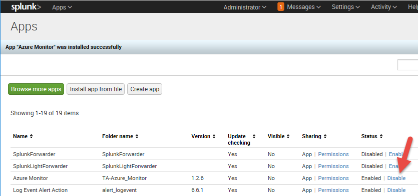

      * Click the **Enable** link to re-enable the add-on.  The add-on should be enabled now without any error messages appearing.

4. Using the output from the `azure-setup.ps1` script above, configure the add-on's data inputs.  Hint, the output from the script is saved to a text file in the same directory as the script and is named `<your resource group name>.azureconfig`.

   * In Splunk, click on **Settings** -> **Data Inputs** at the top of the page.

   * For each of the add-on's data inputs, add a new configuration by copying and pasting the settings from the script's output into the data input's configuration.

      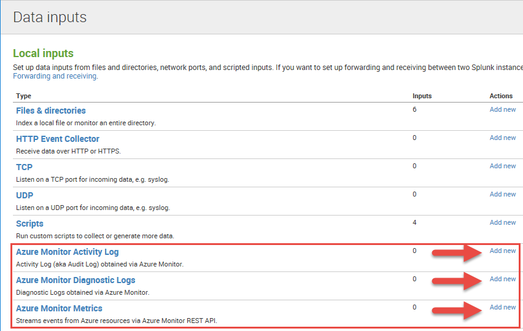

# Support

If you have encountered difficulties with the add-on, the first thing to do is ensure that all Python and Nodejs dependencies are installed correctly according to the installation instructions in the wiki.

If that doesn't help, the next thing to do is switch logging for ExecProcessor to Debug (Settings / Server Settings / Server Logging in Splunk Web) and recycle the add-on (disable/enable). Then search for 'azure_monitor' ERROR and DEBUG messages. There will be a lot of DEBUG messages. If you don't see anything helpful, open an issue in the repo.

# Contributing

This project has adopted the [Microsoft Open Source Code of Conduct](https://opensource.microsoft.com/codeofconduct/). For more information see the [Code of Conduct FAQ](https://opensource.microsoft.com/codeofconduct/faq/) or contact [opencode@microsoft.com](mailto:opencode@microsoft.com) with any additional questions or comments.

## Generating the Splunk package file
It is assumed that contributors of this project will use Visual Studio Code to develop with.  You can download Visual Studio Code fro [here](https://code.visualstudio.com/Download).

As a contributor, you will need to generate a version specific package file that includes your changes, such as `.\packages\TA-Azure_Monitor_1_2_6.spl`.  To properly generate this file, you need to install the following extension in your Visual Studio Code environment:

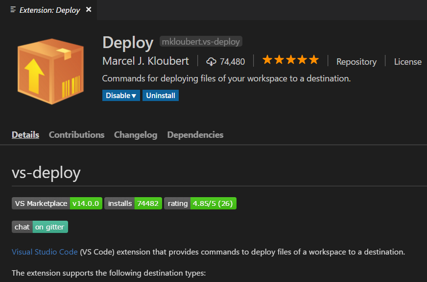

The extension can be installed from the [Visual Studio Code Marketplace](https://marketplace.visualstudio.com/items?itemName=mkloubert.vs-deploy).

Follow the steps below to generate the version specific package file.

1. Open `.\default\app.conf` and bump the **version** property in the **[launcher]** section.

2. Open `.\deployment\package.cmd` and bump the **version** variable at the top of the file.

3. In the Visual Studio Code Explorer, **right-click** on the **bin** folder and select **Deploy current file / folder** as shown below.  

   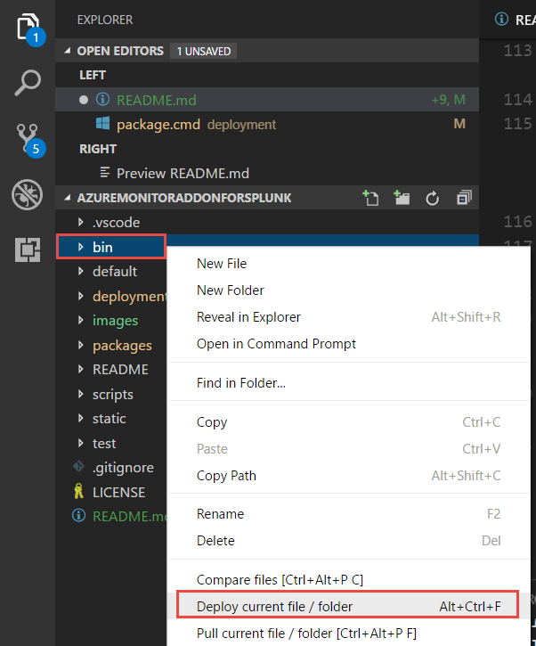

   You will be prompted to select a target from the Visual Studio Code Command Palette, as shown below.  Select **saveAndPackage**.

     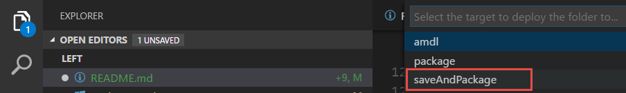

   You will see a command window briefly appear.  The result of this step is the files and directories in the `.\bin` folder are copied to the folder `.\deployment\TA-Azure_Monitor\bin`.  This folder is a temporary holding place that the version specific package file will be generated from.
   
   This step will also result in the version specific package file, which will be in the `.\packages` folder, as shown below for version 1.2.6.

   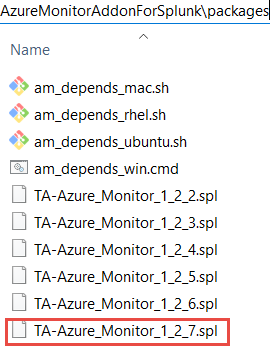

4. Repeat the previous step for the following files and folders highlighted below.

   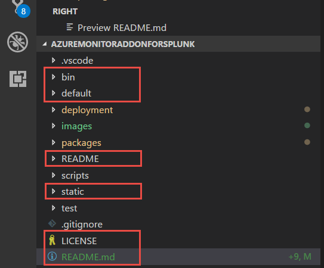

5. The version specific package file should be committed to the repository with your code changes.  It is tradition to also remove the oldest version specific package file when creating a new one.
